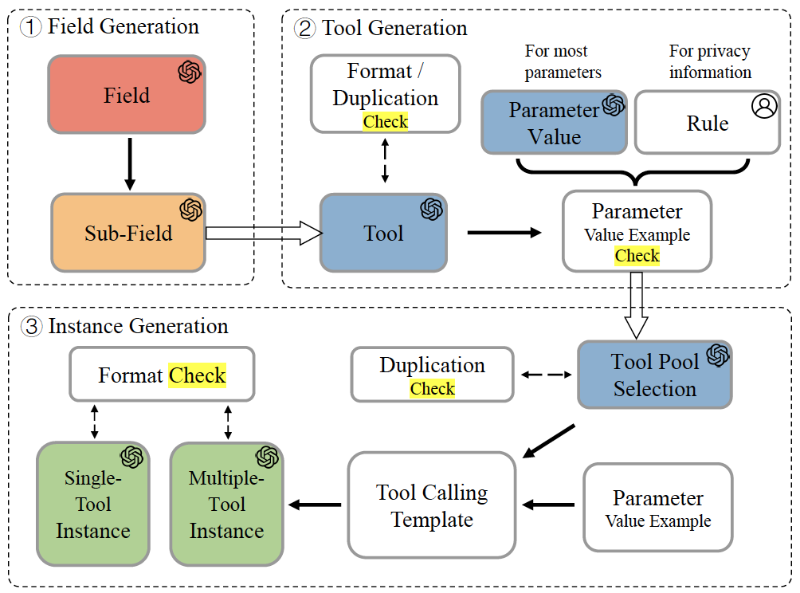
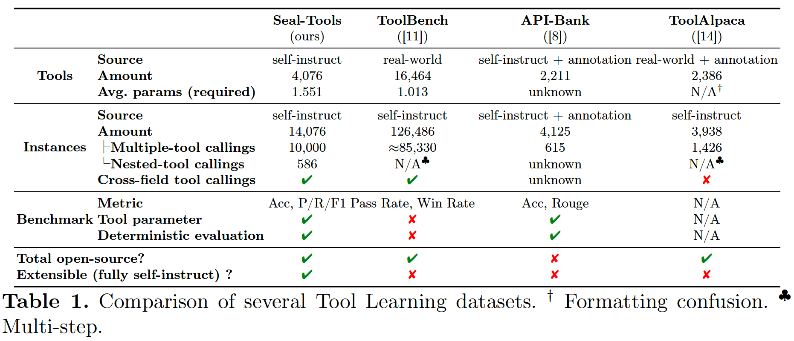

# Seal-Tools

The source code and dataset mentioned in the paper **Seal-Tools: Self-Instruct Tool Learning Dataset for Agent Tuning and Detailed Benchmark**.

https://arxiv.org/abs/2405.08355

🎉 Our paper has been accepted for presentation at the NLPCC 2024 conference.🎉 

https://link.springer.com/chapter/10.1007/978-981-97-9434-8_29

## Files

### ./Dataset_Construct/ 🌟

It contains the source code for our self-instruct dataset construction method. You can try to build up more relevant datasets with it.

### ./Seal-Tools_Dataset/ 🌟

Our dataset construction attempt.

### ./LLM_Evaluation/

Our code for evaluating the tool-calling capabilities of Large Language Models, just for reference because it's not well organized so far.

The eval metrics calculating function `calculate_score_ToolLearning` is in `./LLM_Evaluation/src/llm_tools/evaluation/calculate.py`

### ./DPR_Training/

The data for training the retriever DPR.

The code is from https://github.com/facebookresearch/DPR .
